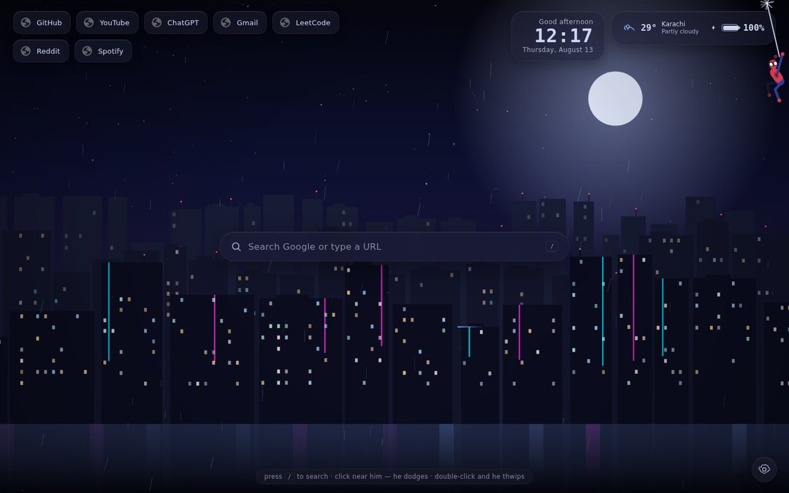
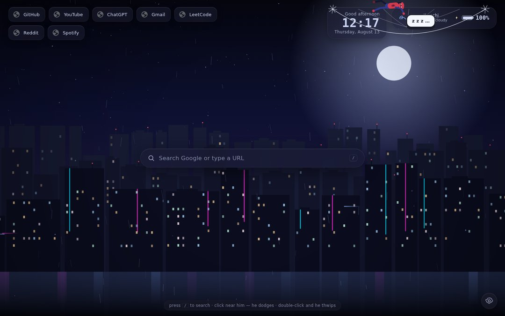
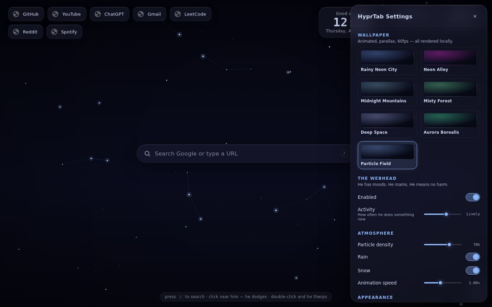
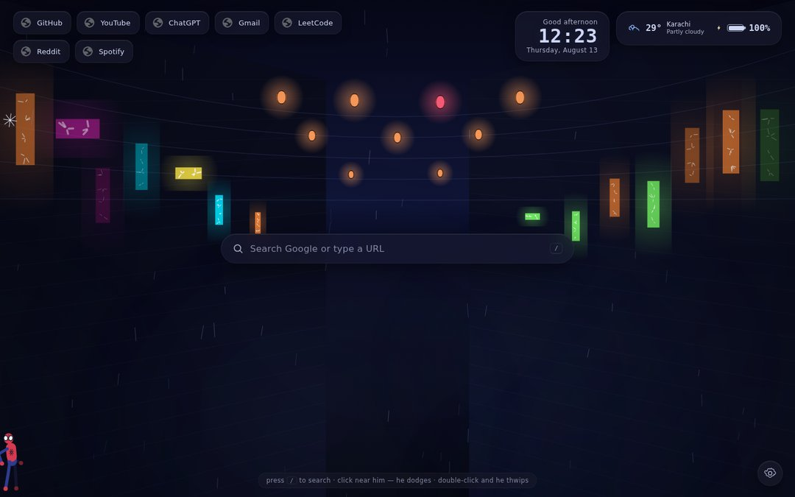

# HyprTab 🕸 — a Hyprland-inspired animated New Tab for Chrome

Turns every new tab into a tiny living desktop: an animated parallax
wallpaper engine, glassmorphic widgets, a Google search bar with a neon
halo — and a resident **web-slinging companion** who walks, runs, hops,
swings on real verlet-physics webs, hangs upside down, naps in a web
hammock, peeks from corners, dodges your cursor and occasionally shows
up in a different suit.




Everything is rendered locally — no servers, no tracking, no CDNs at
runtime. The only network call is the (optional, keyless) weather
lookup to Open-Meteo.

---

## Quick start (load unpacked)

```bash
# only needed if you want to rebuild from source — a prebuilt bundle is included
npm install
npm run build       # → ./js
```

1. Open `chrome://extensions`
2. Enable **Developer mode**
3. **Load unpacked** → select this folder
4. Open a new tab. Say hi. Click near him — he dodges. Double-click — he thwips.

> Rebuilding? `npm run watch` recompiles on every change; hit the reload
> icon on `chrome://extensions` afterwards.

---

## Feature tour

### The wallpaper engine
Seven scenes, all procedural canvas art with layered parallax that
follows your cursor, floating dust, optional rain & snow, a drifting
fog layer, film vignette, and an FPS watchdog that quietly steps
quality down before anything stutters:

| Scene | Mood |
|---|---|
| Rainy Neon City | skyline silhouettes, twinkling windows, flying-vehicle light streaks, rare lightning, wet-street reflections |
| Neon Alley | Japanese backstreet — glowing sign walls with abstract glyphs, swaying lanterns, mirrored footpath |
| Midnight Mountains | four ridgelines, snow caps, star twinkle, moon shafts |
| Misty Forest | layered pines, moonlight beam, wandering fireflies, heavy fog |
| Deep Space | nebula clouds, 3-layer starfield, ringed planet, shooting stars |
| Aurora Borealis | three animated aurora ribbons with curtain folds over mountain silhouettes |
| Particle Field | cursor-reactive plexus — spatial-hashed, O(n) |

### The webhead
A fully procedural character (no sprites, no copyrighted assets):
two-bone IK limbs, blendable poses, expressive mask lenses with
blinking, looking, squints and sleep-eyes, squash & stretch landings.

- **Moods** (`chill / playful / sleepy / alert`) shift a weighted
  behaviour table every minute or two, and recent actions are
  suppressed — so roaming never feels scripted.
- **Web swinging** is a verlet rope with real pendulum physics:
  momentum carry, rope pumping, release at the apex, chained swings,
  snap-back recoil on release, impact splats.
- **Idles**: sits, sleeps (with "z z z" bubble), checks an imaginary
  watch, waves, crouches, perches upside-down, naps in a hand-woven
  web hammock.
- **Reactions**: eyes follow the cursor; approach fast and he bolts;
  click near him and he dodge-hops; double-click and he points &
  thwips; hover or type in the search bar and he strolls over to peek;
  open settings and he skedaddles — close them and he swings back in.
- **Easter eggs** (each on long jittered cooldowns): a tiny spider
  crossing the ceiling, a spider emblem drawn out of web silk, hanging
  in front of the search bar, comic quip bubbles, and rare cameo suits
  (a black/red stealth set, a white/pink ghost set).

### Widgets
Clock (12/24h, optional seconds), date, greeting (name-aware), weather
(Open-Meteo, cached 30 min, graceful offline hiding), battery (where
the Battery API exists), and a quick-links bar fed by Chrome's own
favicon cache with usage-based self-sorting.

### Sounds
All synthesized live with WebAudio — no audio files: web *thwips*,
landing thuds, footsteps, swing whooshes and a gentle rain ambience.
Off by default; toggle in settings.

---

## Settings

Everything is live-applied and synced via `chrome.storage.sync` —
the toolbar popup toggles the common ones from any page.

Wallpaper · Spider activity · Rain/Snow · Particle density · Animation
speed · Theme (Catppuccin Mocha / Tokyo Night / Nord / Cyberpunk) ·
Accent colour · Glass blur · Clock format · Greeting name · Weather
(unit + city) · Battery · Quick links (add/remove/reorder-by-usage) ·
Performance mode · Sound & volume · Export/Import/Reset JSON.




---

## Performance & accessibility

- Two canvases, capped DPR (1.6× normal, 1× in performance mode)
- Static layers pre-rendered offscreen; zero per-frame allocations in
  hot loops (pooled rain/snow/dust)
- FPS watchdog → automatic quality scaling
- Everything pauses when the tab is hidden (`visibilitychange`)
- `prefers-reduced-motion` respected: wallpaper renders a single still
  frame and the webhead walks calmly instead of swinging
- ARIA roles on controls, keyboard focus styles, `/` focuses search,
  `Esc` closes settings

---

## Project layout

```
hypertab/
├── manifest.json            # MV3
├── newtab.html / popup.html
├── styles/                  # newtab.css, popup.css
├── lib/gsap.min.js          # DOM micro-animations (local, offline)
├── js/                      # built bundles (commit-ready extension)
├── assets/
│   ├── icons/               # generated extension icons 16–128
│   └── wallpapers/          # tiny scene posters (first-paint + picker chips)
├── animations/              # (reserved for future Lottie packs)
├── src/
│   ├── types.ts             # shared contracts
│   ├── settings/            # schema (defaults+validation), store, themes, panel UI
│   ├── scene/               # wallpaper engine + overlays + 7 scenes
│   ├── widgets/             # clock, weather, battery, links
│   ├── spider/              # rig (procedural character), web physics,
│   │                        #   brain (moods/policy), controller (behaviours+eggs)
│   ├── audio/sound.ts       # WebAudio synth engine
│   ├── newtab/ popup/ background/ content/   # entry points
├── scripts/                 # build helpers (all optional dev tooling)
│   ├── pack.mjs             # → release/hypertab.zip for Web Store upload
│   ├── smoke.mjs            # headless load + liveness trace
│   ├── beauty.mjs           # behaviour screenshot rig
│   ├── tour.mjs             # scene tour screenshots
│   └── posters.mjs          # regenerates assets/wallpapers/*
└── docs/                    # README screenshots
```

## Permissions — what & why

| Permission | Why |
|---|---|
| `storage` | settings sync + weather/link caches |
| `favicon` | crisp site icons in the quick-links bar |
| `contextMenus` | "Open a HyprTab" right-click shortcut |
| `host: api.open-meteo.com` (+geocoding) | optional weather; the extension works fully offline without it |

## Handies

- **`/`** — focus the search bar
- **Alt+Shift+T** on any page — open a HyprTab
- **Esc** — close settings
- DevTools: `window.__spider` — poke him (`__spider.dispatch('hammock')`)

## License

MIT. The character is an original procedural creation; no copyrighted
assets are used anywhere in this project.
