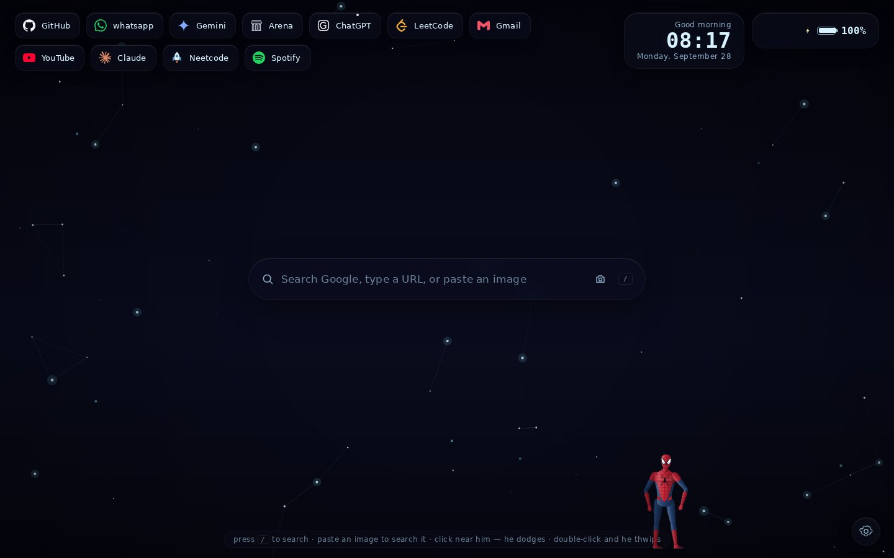
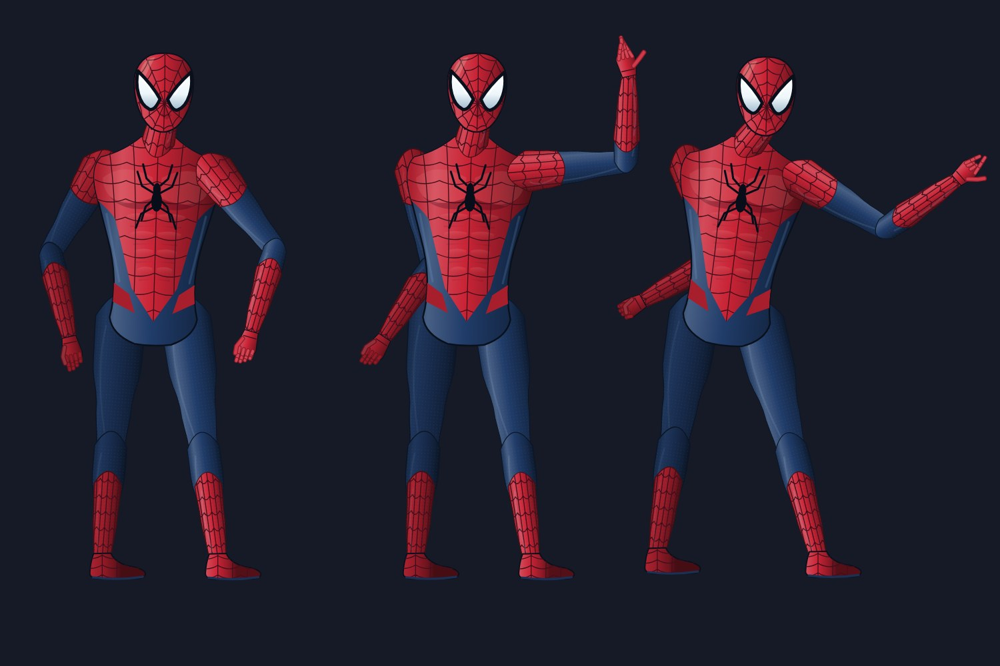

# HyprTab 🕸 — a Hyprland-inspired animated New Tab for Chrome

Turns every new tab into a tiny living desktop: an animated parallax
wallpaper engine, glassmorphic widgets, a Google search bar with a neon
halo — and a resident **web-slinging companion** who walks, runs, hops,
swings on real verlet-physics webs, hangs upside down, naps in a web
hammock, peeks from corners, dodges your cursor and occasionally shows
up in a different suit.




Everything is rendered locally — no servers, no tracking, no CDNs at
runtime. Optional weather uses Open-Meteo; non-curated shortcut icons may fall back
to Google’s favicon service. The default shortcut icons are bundled locally.

---

## Quick start (load unpacked)

```bash
# only needed if you want to rebuild from source — a prebuilt bundle is included
npm install
npm run build       # → ./js
```

1. Open `chrome://extensions`
2. Enable **Developer mode**
3. **Load unpacked** → select this folder
4. Open a new tab. Say hi. Click near him — he dodges. Double-click — he thwips.

> Rebuilding? `npm run watch` recompiles on every change; hit the reload
> icon on `chrome://extensions` afterwards.

---

## Feature tour

### The wallpaper engine
Seven scenes, all procedural canvas art with layered parallax that
follows your cursor, floating dust, optional rain & snow, a drifting
fog layer, film vignette, and an FPS watchdog that quietly steps
quality down before anything stutters:

| Scene | Mood |
|---|---|
| Rainy Neon City | skyline silhouettes, twinkling windows, flying-vehicle light streaks, rare lightning, wet-street reflections |
| Neon Alley | Japanese backstreet — glowing sign walls with abstract glyphs, swaying lanterns, mirrored footpath |
| Midnight Mountains | four ridgelines, snow caps, star twinkle, moon shafts |
| Misty Forest | layered pines, moonlight beam, wandering fireflies, heavy fog |
| Deep Space | nebula clouds, 3-layer starfield, ringed planet, shooting stars |
| Aurora Borealis | three animated aurora ribbons with curtain folds over mountain silhouettes |
| Particle Field | cursor-reactive plexus — spatial-hashed, O(n) |

### The webhead
A completely rebuilt, procedural **movie-inspired illustrated** character.
It is vector art, not a photorealistic 3D movie model or a pasted reference image.

- **Athletic silhouette** — a smaller, sculpted mask with angular reflective
  lenses, broader shoulders, tapered limbs, pectoral/abdominal shading,
  navy side panels, red gauntlets and boots, and contour-following webbing.
- **Matrix hierarchy** (`matrix.ts`, `skeleton.ts`) — row-major 3×3 affine
  multiplication composes body, spine, shoulders, wrists, head and finger
  branches. Inverse transforms keep cursor aiming and lighting consistent
  through mirroring, rotation, and landing compression.
- **Reach-safe IK** — both the joint and endpoint are solved, including
  coincident/unreachable targets. Bone lengths stay fixed; bend changes
  project through depth rather than snapping or stretching the forearm.
- **Articulated gestures** (`poses.ts`) — separate thumb and finger curls,
  spread and wrist angles blend between relaxed hands, fists, web grips,
  open-palm waves, salutes and the web-shooting sign. Head turns and lens
  expressions accompany full-body poses.
- **Shared attachment geometry** — webs meet the rendered hand during a swing
  and the ankles during an upside-down hang. Double-click aims first, then
  emits the strand from the actual wrist/palm location.
- **Locomotion** — procedural walk/run gait, independent wall-crawl contacts,
  crouch and three-point landing poses, breathing and exponential pose blends.
  Reduced-motion mode shows a stationary companion without roaming or gestures.
- **Local rendering** — cached vector paths and quality-dependent suit details;
  no external character assets, WebGL dependency, or model downloads.

- **Moods** (`chill / playful / sleepy / alert`) shift a weighted
  behaviour table every minute or two, and recent actions are
  suppressed — so roaming never feels scripted.
- **Web swinging** is a verlet rope with real pendulum physics:
  momentum carry, rope pumping, release at the apex, chained swings,
  snap-back recoil on release, impact splats.
- **Idles**: sits, sleeps (with "z z z" bubble), checks an imaginary
  watch, waves, salutes, crouches, perches upside-down, naps in a hand-woven
  web hammock.
- **Reactions**: eyes follow the cursor; approach fast and he bolts;
  click near him and he dodge-hops; double-click and he points &
  thwips; hover or type in the search bar and he strolls over to peek;
  open settings and he skedaddles — close them and he swings back in.
- **Easter eggs** (each on long jittered cooldowns): a tiny spider
  crossing the ceiling, a spider emblem drawn out of web silk, hanging
  in front of the search bar, comic quip bubbles, and rare cameo suits
  (a black/red stealth set, a pale/navy ghost set).

### Widgets
Clock (12/24h, optional seconds), date, greeting (name-aware), weather
(Open-Meteo, cached 30 min, graceful offline hiding), battery (where
the Battery API exists), and quick links. The new default is **dark particles**,
no rain, and the screenshot-order list: GitHub, WhatsApp, Gemini, Arena,
ChatGPT, LeetCode, Gmail, YouTube, Claude, Neetcode, Spotify.
**Flex is pending the user's exact URL** and is not linked to a guessed site.

Bookmark import and usage sorting are opt-in, so the curated order stays
stable. Icons for these defaults are bundled; custom links fall back through
Chrome's favicon cache → Google's favicon service → a generated monogram.

Existing saved settings and custom links are preserved. To adopt the new
look/list on an existing installation, open **Settings → Quick links → Apply
particle preset** and confirm. This changes only appearance/atmosphere and
shortcuts, not unrelated preferences. **Reset** applies all fresh defaults.
The redesigned character renderer applies immediately after extension reload.

### Search, like Chrome's omnibox and then some
Text queries and URLs navigate as usual; **copied or dragged images are
accepted by the search bar** (paste anywhere, drop on the bar, or the
camera button) and Enter uploads them to Google's reverse-image search
— Lens-style "search with an image", including AI-mode results on
Google's side.

### Sounds
All synthesized live with WebAudio — no audio files: web *thwips*,
landing thuds, footsteps, swing whooshes and a gentle rain ambience.
Off by default; toggle in settings.

---

## Settings

Everything is live-applied and synced via `chrome.storage.sync` —
the toolbar popup toggles the common ones from any page.

Wallpaper · Spider activity · Rain/Snow · Particle density · Animation
speed · Theme (Catppuccin Mocha / Tokyo Night / Nord / Cyberpunk) ·
Accent colour · Glass blur · Clock format · Greeting name · Weather
(unit + city) · Battery · Quick links (add/remove/reorder-by-usage) ·
Performance mode · Sound & volume · Export/Import/Reset JSON.


---

## Performance & accessibility

- Two canvases, capped DPR (1.6× normal, 1× in performance mode)
- Static layers pre-rendered offscreen; zero per-frame allocations in
  hot loops (pooled rain/snow/dust)
- FPS watchdog → automatic quality scaling
- Everything pauses when the tab is hidden (`visibilitychange`)
- `prefers-reduced-motion` respected: wallpaper renders a single still
  frame and the webhead walks calmly instead of swinging
- ARIA roles on controls, keyboard focus styles, `/` focuses search,
  `Esc` closes settings

---

## Project layout

```
hypertab/
├── manifest.json            # MV3
├── newtab.html / popup.html
├── styles/                  # newtab.css, popup.css
├── lib/gsap.min.js          # DOM micro-animations (local, offline)
├── js/                      # built bundles (commit-ready extension)
├── assets/
│   ├── icons/               # generated extension icons 16–128
│   └── wallpapers/          # tiny scene posters (first-paint + picker chips)
├── animations/              # (reserved for future Lottie packs)
├── src/
│   ├── types.ts             # shared contracts
│   ├── settings/            # schema (defaults+validation), store, themes, panel UI
│   ├── scene/               # wallpaper engine + overlays + 7 scenes
│   ├── widgets/             # clock, weather, battery, links
│   ├── spider/              # matrix math, skeleton/IK, poses, anatomy/gait,
│   │                        #   rig (vector character), web physics,
│   │                        #   brain (moods/policy), controller (behaviours+eggs)
│   ├── audio/sound.ts       # WebAudio synth engine
│   ├── newtab/ popup/ background/ content/   # entry points
├── scripts/                 # build helpers (all optional dev tooling)
│   ├── pack.mjs             # → release/hypertab.zip for Web Store upload
│   ├── smoke.mjs            # headless load + liveness trace
│   ├── beauty.mjs           # behaviour screenshot rig
│   ├── tour.mjs             # scene tour screenshots
│   ├── posters.mjs          # regenerates assets/wallpapers/*
│   └── preview/rigshot.mjs  # headless character sheet (poses + gait cycles)
└── docs/                    # README screenshots
```

## Permissions — what & why

| Permission | Why |
|---|---|
| `storage` | settings sync + weather/link caches |
| `favicon` | crisp site icons in the quick-links bar |
| `bookmarks` | import your bookmarks into the quick-links bar |
| `contextMenus` | "Open a HyprTab" right-click shortcut |
| `host: api.open-meteo.com` (+geocoding) | optional weather; the extension works fully offline without it |

## Handies

- **`/`** — focus the search bar
- **Ctrl+V with a screenshot copied** — attach it to the search bar for reverse-image search
- **Alt+Shift+T** on any page — open a HyprTab
- **Esc** — close settings
- DevTools: `window.__spider` — poke him (`__spider.dispatch('hammock')`)

## License

Project code: MIT. The character is procedurally drawn; the supplied reference
image is not bundled. Shortcut icons include Simple Icons (CC0); attribution
and trademark notes are in `assets/links/README.md`. No affiliation with the
referenced character or shortcut brands is implied.

## Development checks

```bash
npm run typecheck
npm test                 # dependency-free matrix/IK/pose/controller checks
npm run build            # updates the checked-in extension bundles
npm run preview          # web preview at port 4173 (dev-only browser API shim)
# Optional image/browser checks:
npm run shots:setup
npm run rigshot
npm run rigshot:closeup
node scripts/preview/check.mjs  # preview server must be running
```

The unit suite checks 6,144 pose-transition frames, fixed bone lengths,
coincident/out-of-reach IK, fingers, all 17 behaviors, exact web attachments,
settings toggles, resizing, and reduced motion. The browser suite also checks
offline default icons, keyboard search, saved settings, the preset button,
mobile DPR 2, and rendering all behaviors. Set `PUPPETEER_EXECUTABLE_PATH` to
use an already installed Chromium. Preview scripts are not included in the
extension ZIP; they never replace Chrome APIs in an installed extension.
